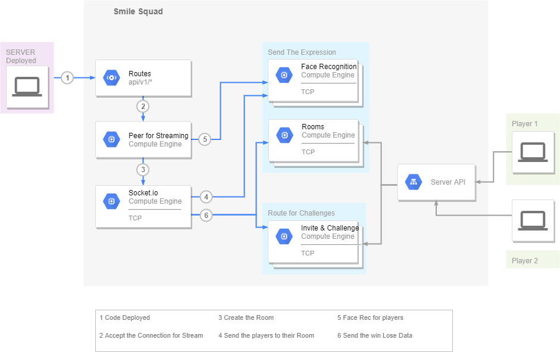
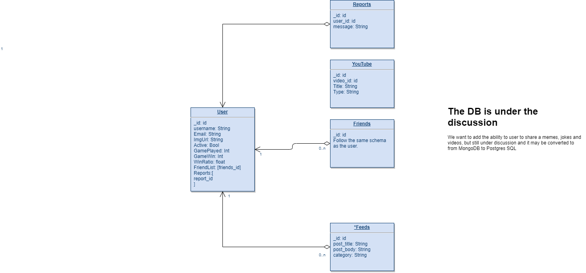

# Smile-Squad

## Team members:

- Ayoub Kandah
- Baha Zghayar
- Raghad Mustafa
- Omar Tarawnih
- Faten Samman

## Planning

- We are going to meet everyday at 9:00 pm at Remo
- Discuss our progress, and the requriment.

## Deliverable

### Conflict Plan

- Resovling Conflict:

  - When a conflict arise we all going to meet and resolve it.

  - We all going to contribute equally, and we going to make that happen

  - We are going to discuss the functionality and check to new branch and solve it.

### Communication Plan

- We are going to communicate via Slack and Whatsapp

- We are going to make a vote on every features and functionality

- we are going to make sure everyone will speak if something happen

### Work Plan

- Using Trello and GitHub project board to assign task and everyong complete their assignment.

- Trello.

### Git Process

- Our API that will be consumed by our frontend.

- Using GitHub Orginaiztion.

- We will use the PR review:
  - Two will be reviewing the PR and confirm the merge.
  - The team leader
  - It depends on the workflow.
  - If the PR get approved we will merge it.

## Wireframe

### User Stories

1. Title: Playing 1 vs 1
   User story sentence: As a player I want to sign up and play vs another player the laughing game, and have the ability to add my friends.
   Feature tasks:

   1. The player can sign up.
   2. The player can play against another player.
      Acceptance Tests:
   3. Ensure the player signed up.
   4. Ensure that the player is in the database.
   5. Provide error message and abort transaction if system becomes unavailable.
      Estimated time: 1 day

2. Title: Reading jokes
   User story sentence: As a user I want to sign in and read several jokes.
   Feature tasks:

   1. The user can sign in and read jokes in the app.
      Acceptance Tests:
   1. Ensure the user have an account.
   1. Provide error message and abort transaction if system becomes unavailable.
      Estimated time: 1 day and a half

3. Title: Watching funny videos
   User story sentence: As a user I want to watch funny videos.
   Feature tasks:

   1. The user can sign in and watch funny videos.
      Acceptance Tests:
   1. Ensure the user have an account.
   1. Provide error message and abort transaction if system becomes unavailable.
      Estimated time: 1 day and a half

4. Title: Admin
   User story sentence: As an Admin I want to have the ability to write, edit, delete jokes, and have the ability to add my friends.
   Feature tasks:

   1. The admin can do several things like writing, editing, and deleting.
      Acceptance Tests:
   1. Ensure the user is an admin in the database.
   1. Provide error message and abort transaction if system becomes unavailable.
      Estimated time: 1 day

5. Title: Sign up using Facebook or Google
   User story sentence: As a user I want to sign up using Facebook or Google.
   Feature tasks:
   1. The user can have an account when he/she signed up using Facebook or Google
      Acceptance Tests:
   1. Ensure that the player is in the database when he/she signed up.
   1. Provide error message and abort transaction if system becomes unavailable.
      Estimated time: 1 day

[Project Managment Board](https://trello.com/b/2Z0xuYDT/smile-squad-code401-project)

## Domain Modeling

## MonogeDB

Our App mainly use the TCP connection - Socket.io, Peer.js - for send data back and forth.
We still have a simple database for storing the user data and youtube Video_id
We don't have that many relation so we decided to use mongoDB for our Webiste

- User Table

  - We store it's name, email and img url that we get from Google or Facebook or from using Basic Auth.
  - Friend List store an array of the user friends id that we can refere to at the time we need.
  - Reports have relation with Reports table for a certain user that will be provided from the other users.
  - if the admin decided that the user is should be blocked we change the user account active from true to false and will be blocked from useing the website.

- Youtube Table
  - We decided to store all the videos we get from the youtube API because we have a limit number of request per day.
